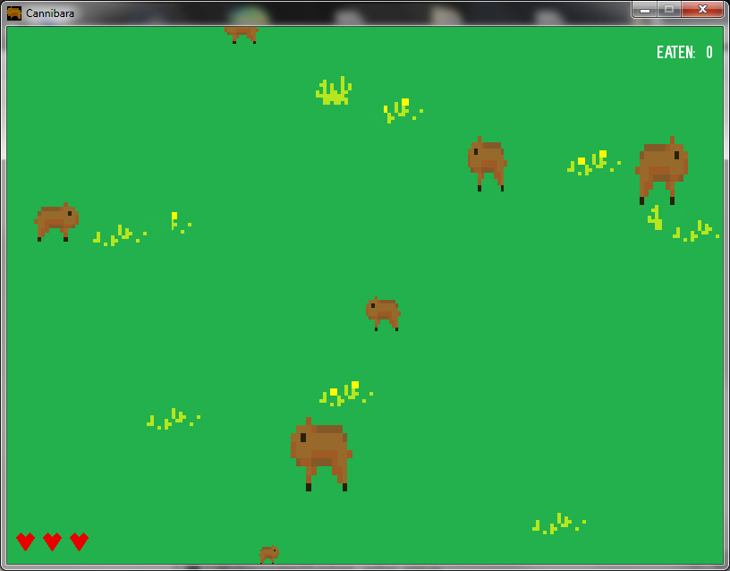

# Cannibara - kapibara spotyka agar.io

Stań się ultra kanibalem kapibarą

 - jedz mniejsze kapibary
 - uciekaj przed większymi od siebie 
 
Sterowanie klawiszami:

WSAD/strzałki - ruch
'p' - pauza
'esc' - natychmiasowe zamknięcie aplikacji
             
Projekt wykonany z wykorzystaniem Pythona 3.4 oraz PyGame 1.9.2a0 dla Pythona 3.4 w celu nauki tych technologii.

#
Katalog z plikami wykonywalnymi dostępny tutaj: 

https://my.pcloud.com/publink/show?code=XZQpDQ7ZPxT1QhWrsWhtw05lQoiukL3nJuay

Instrukcja: wypakuj plik zip i uruchom main.exe 

#
Become an ultra cannibal capybara

 - eat smaller capybaras
 - run away from the bigger ones
 
Key controls:

WSAD / arrows - movement
'p' - pause
'esc' - immediate closure of the application

Project made using Python 3.4 and PyGame 1.9.2a0 for Python 3.4  in order to learn about these technologies.

Catalog with executable files available here:

https://my.pcloud.com/publink/show?code=XZQpDQ7ZPxT1QhWrsWhtw05lQoiukL3nJuay

Instructions: extract the zip file and run main.exe